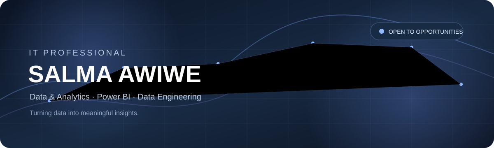

  

<a href="https://salma2220.github.io/portfolio/">🌐 Portfolio</a>
&nbsp;&nbsp; · &nbsp;&nbsp;
<a href="https://www.linkedin.com/in/salma-awiwe">💼 LinkedIn</a>
&nbsp;&nbsp; · &nbsp;&nbsp;
<a href="https://www.behance.net/salmaowiwy">🎨 Behance</a>
&nbsp;&nbsp; · &nbsp;&nbsp;
<a href="mailto:salma.awiwe@gmail.com">📧 Email</a>
&nbsp;&nbsp; · &nbsp;&nbsp;
<a href="https://drive.google.com/drive/folders/1ShKPcmFX_qC6Ti8iMajwYIqiJ491EH3_?usp=sharing">📄 CV</a>

---

## 👋 About Me

IT professional with experience in **enterprise systems, data operations, reporting, and IT support**.

My interests include **Data Analytics, Data Engineering, Power BI, and Data Visualization**. I enjoy turning data into clear insights and building practical technology solutions.

---

## ⚡ Tech Stack

<table>
<tr>

<td width="33%" valign="top">

### 📊 Data & Analytics

</td>

<td width="33%" valign="top">

### ☁️ Data Engineering

</td>

<td width="33%" valign="top">

### 💻 Development

</td>

</tr>
</table>

---

## 🚀 Featured Projects

<table>
<tr>

<td width="50%" valign="top">

### 🔵 FURAS

**Tender & RFP Opportunities**

Data Engineering project integrating tender data from multiple procurement sources and presenting technology opportunities through an interactive Power BI dashboard.

**My contribution**

- Tender data collection
- Azure Bronze layer
- Power BI dashboard
- KPIs & interactive visualizations

**[→ View Project](https://github.com/salma2220?tab=projects)**

</td>

<td width="50%" valign="top">

### 🤖 DataGap AI

**Data Readiness Assistant**

AI-powered solution that analyzes data readiness, identifies data gaps, and provides actionable recommendations.

🏆 **Second Place — KANZ AI Hackathon**

**[→ View Project](https://github.com/salma2220?tab=projects)**

</td>

</tr>

<tr>

<td width="50%" valign="top">

### 🎨 Insight AI

**AI & Security Prediction**

UI/UX design and system flow contribution for an AI-based stolen vehicle detection concept.

**[→ View on Behance](https://www.behance.net/salmaowiwy)**

</td>

<td width="50%" valign="top">

### 📊 Cultural Data Horizon

Interactive Power BI dashboard for analyzing and visualizing Saudi cultural heritage data.

**[→ View Project](https://github.com/salma2220?tab=projects)**

</td>

</tr>
</table>

---

## 💡 Focus Areas

<table>
<tr>

<td align="center">📊 Data Analytics</td>
<td align="center">📈 Power BI</td>
<td align="center">☁️ Data Engineering</td>

</tr>

<tr>

<td align="center">🔄 Data Integration</td>
<td align="center">🗄️ SQL</td>
<td align="center">🏢 Enterprise Systems</td>

</tr>
</table>

---

## ✦ Let's Connect

**IT · Data Analytics · Data Engineering · Power BI**

  

<a href="https://salma2220.github.io/portfolio/">🌐 Portfolio</a>
&nbsp;&nbsp; · &nbsp;&nbsp;
<a href="https://www.linkedin.com/in/salma-awiwe">💼 LinkedIn</a>
&nbsp;&nbsp; · &nbsp;&nbsp;
<a href="https://www.behance.net/salmaowiwy">🎨 Behance</a>
&nbsp;&nbsp; · &nbsp;&nbsp;
<a href="mailto:salma.awiwe@gmail.com">📧 Email</a>
&nbsp;&nbsp; · &nbsp;&nbsp;
<a href="https://drive.google.com/drive/folders/1ShKPcmFX_qC6Ti8iMajwYIqiJ491EH3_?usp=sharing">📄 CV</a>

